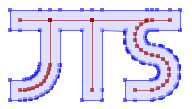

# JTS Test Builder

[The JTS Topology Suite](https://github.com/locationtech/jts) is a Java library for creating and manipulating vector geometry. It also provides a comprehensive set of geometry test cases, and the TestBuilder GUI application for working with and visualizing geometry and JTS functions.

JTS includes some application tools to make it easier to work with geometry and JTS functions. [JTS TestBuilder](https://github.com/locationtech/jts/blob/master/doc/JTSTestBuilder.md) is a GUI for creating, editing, and processing geometry.

This plugin just integrate the JTS TestBuilder into JetBrains IDEs.

## Installation

- Using IDE built-in plugin system:
  
  <kbd>Settings/Preferences</kbd> > <kbd>Plugins</kbd> > <kbd>Marketplace</kbd> > <kbd>Search for "JTS Test Builder"</kbd> >
  <kbd>Install Plugin</kbd>
  
- Manually:

  Download the [latest release](https://github.com/LiLittleCat/intellij-jts-test-builder/releases/latest) and install it manually using
  <kbd>Settings/Preferences</kbd> > <kbd>Plugins</kbd> > <kbd>⚙️</kbd> > <kbd>Install plugin from disk...</kbd>

## Usage

- Open the JTS Test Builder window: <kbd>Tools</kbd> > <kbd>JTS Test Builder</kbd>
- Right-click on the editor and select <kbd>JTS Test Builder</kbd>

